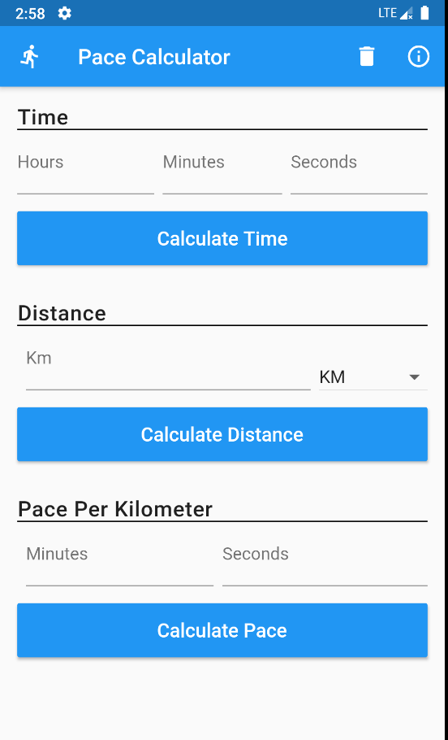
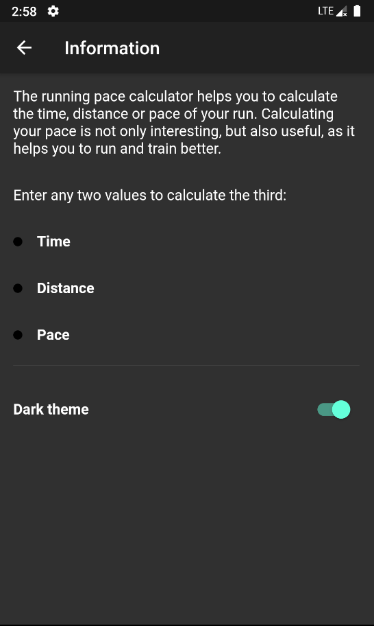
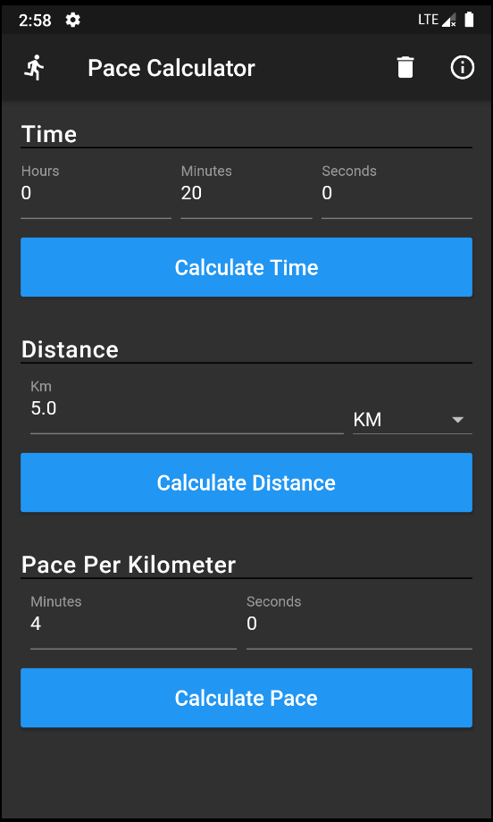

# pace_calculator

Running pace calculator built with Flutter. Calculate time, distance or pace for your run.

### Addign translations
flutter pub run intl_translation:extract_to_arb --output-dir=lib/translations lib/translations/localisations.dart

flutter pub run intl_translation:generate_from_arb --output-dir=lib/translations --no-use-deferred-loading li
b/translations/localisations.dart lib/translations/intl_*.arb

